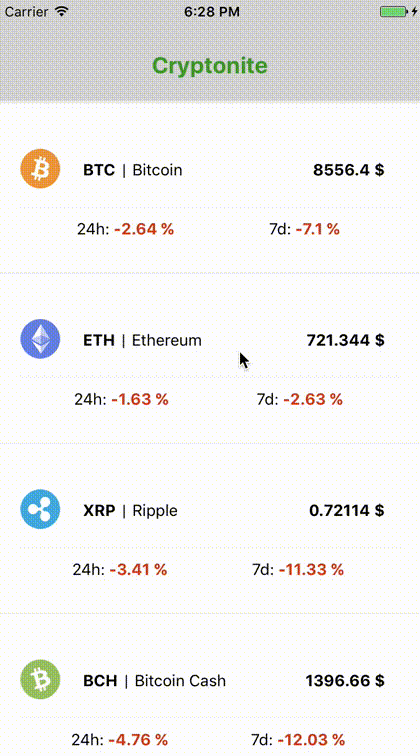

Cryptonite is a simple cryptocurrency app, written in react-native, that utilises the CoinMarketCap and CryptoPanic APIs.

It's an incarnation of the [Let’s Build: Cryptocurrency Native Mobile App With React Native + Redux](https://medium.com/react-native-training/bitcoin-ripple-ethereum-price-checker-with-react-native-redux-e9d076037092) tutorial and has evolved into a pet project with some additional features, animiations and screen transitions.

